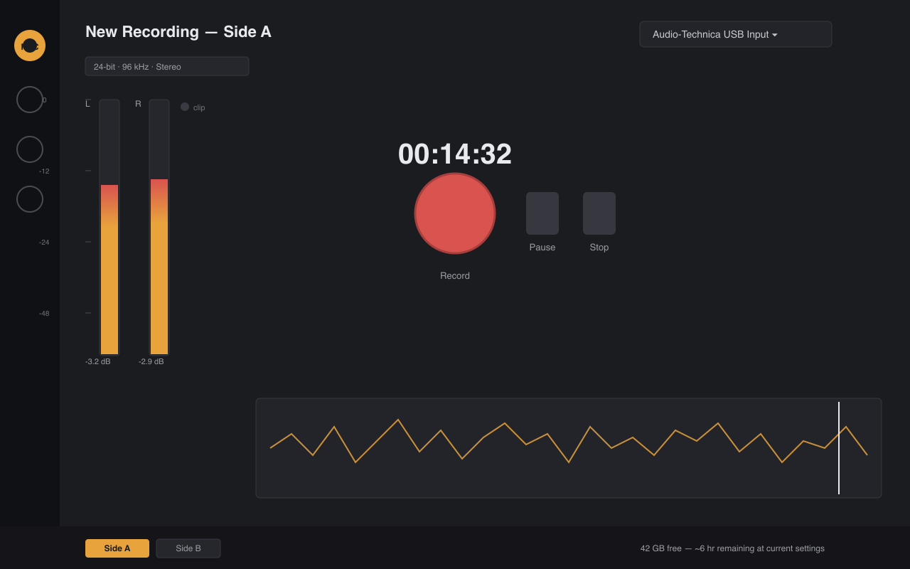
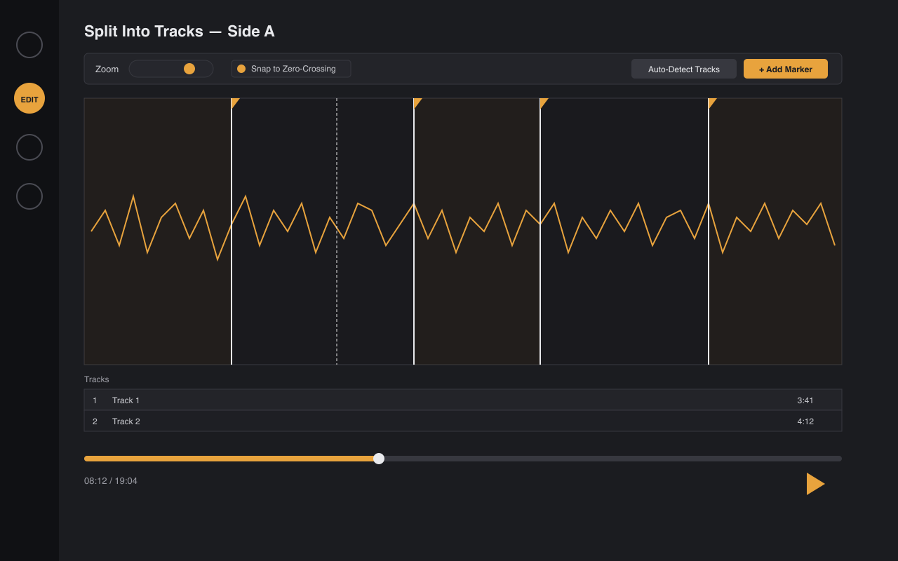
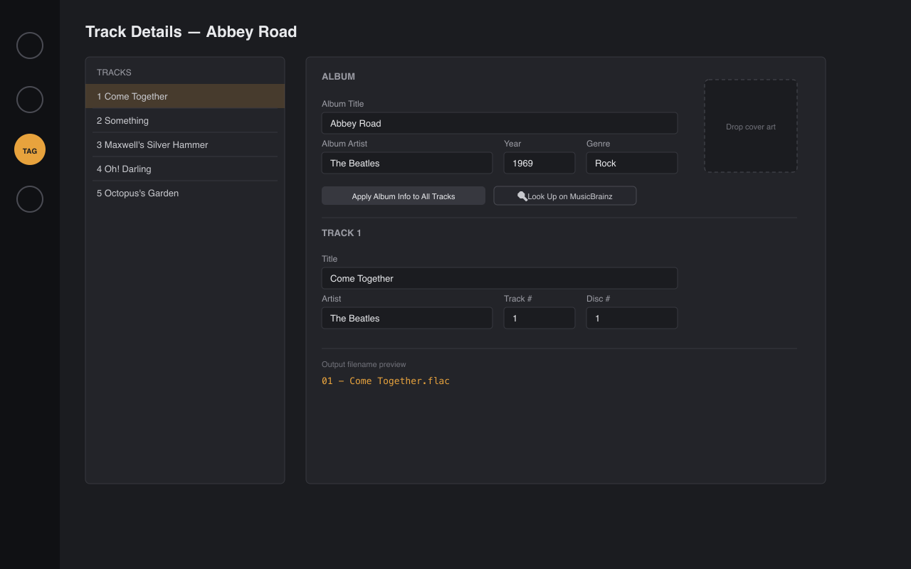
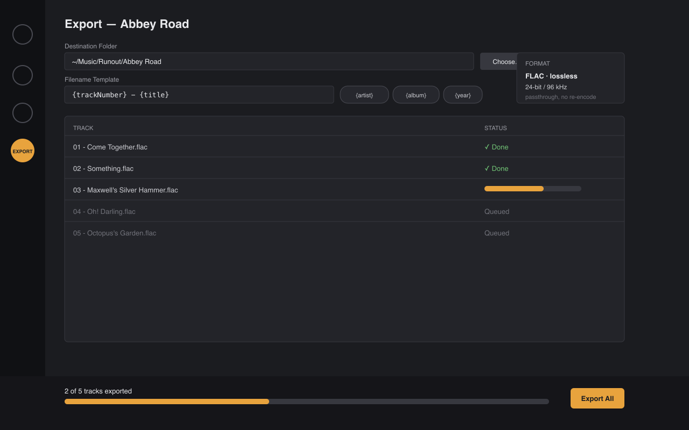

# Runout

Rip vinyl records to FLAC on macOS and iPadOS — record a side, split it into tracks on a waveform, tag each track, export lossless FLAC files.



Runout is for personal archival of vinyl you own, the same use case as any CD-ripping tool. It captures line-level audio from a turntable/phono preamp, writes it losslessly, and never re-encodes or lossily transcodes anything along the way.

## Features

- Record straight to a lossless master file (native FLAC via Core Audio, up to 24-bit/192kHz), with real-time level metering and clip warning.
- Split a full side into individual tracks by placing markers on the waveform, with zero-crossing snapping and optional silence-based split suggestions.
- Per-track and album-level metadata (title, artist, album, year, genre, track/disc number, cover art), with a live filename preview.
- Batch export to individually tagged, lossless FLAC files.
- Non-destructive project format — the original full-side recording is always kept, so re-splitting or re-tagging later never requires re-recording the record.
- One project file syncs between Mac and iPad via iCloud Drive/Files, no custom sync code.

See [`docs/FEATURES.md`](docs/FEATURES.md) for the full feature spec, including a section on things worth knowing about that aren't obvious from the initial ask.

## Screens

| Record | Split into tracks |
|---|---|
|  |  |

| Tag | Export |
|---|---|
|  |  |

(These are layout wireframes used to drive implementation, not final screenshots — see [`docs/UI_SPEC.md`](docs/UI_SPEC.md). Once the app is running, this section should be updated with real screenshots.)

## Status

The full roadmap (M0-M11) is done: record → view the waveform → split into tracks → tag → export to lossless FLAC, all backed by a real `.runout` document (open/save/iCloud Drive sync via SwiftUI's `DocumentGroup`, no more ad-hoc sidecar files), plus every stretch goal — silence-based auto-split, MusicBrainz + Cover Art Archive lookup, configurable fades and declick, accessibility/keyboard shortcuts, and a signed/notarized release pipeline. Every milestone has been verified against real audio hardware, not just synthetic test data. See [`docs/ROADMAP.md`](docs/ROADMAP.md) for the build history and [`docs/IMPROVEMENT_PLAN.md`](docs/IMPROVEMENT_PLAN.md) for an ongoing post-launch hardening pass.

## Documentation

- [`docs/ARCHITECTURE.md`](docs/ARCHITECTURE.md) — tech stack, module breakdown, data flow, platform differences
- [`docs/DATA_MODEL.md`](docs/DATA_MODEL.md) — project file format and all data types
- [`docs/FLAC_METADATA_SPEC.md`](docs/FLAC_METADATA_SPEC.md) — exact byte-level spec for writing FLAC tags/cover art
- [`docs/FEATURES.md`](docs/FEATURES.md) — full functional spec
- [`docs/UI_SPEC.md`](docs/UI_SPEC.md) — screen-by-screen UI spec
- [`docs/ROADMAP.md`](docs/ROADMAP.md) — phased build plan with acceptance criteria per milestone

## Requirements

- macOS 14+ and/or iPadOS 17+
- Xcode 16+
- [XcodeGen](https://github.com/yonaskolb/XcodeGen) (`brew install xcodegen`) — the Xcode project is generated from `project.yml`, not committed, so it never goes stale or produces merge conflicts
- A turntable feeding a line-level, RIAA-corrected signal into a Core Audio input device (e.g. via a USB turntable or a turntable through a separate phono preamp)

## Building

```
brew install xcodegen   # once
xcodegen generate       # regenerate Runout.xcodeproj from project.yml after every pull or project.yml change
open Runout.xcodeproj
```

Select the `RunoutMac` scheme to run on your Mac, or `RunoutiOS` to run on an iPad/iPad simulator. No other external dependencies to install — FLAC read/write is native via Core Audio (see `docs/ARCHITECTURE.md` for why).

## Contributing

See [`CONTRIBUTING.md`](CONTRIBUTING.md).

## License

MIT — see [`LICENSE`](LICENSE).
